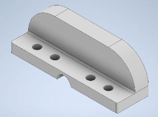
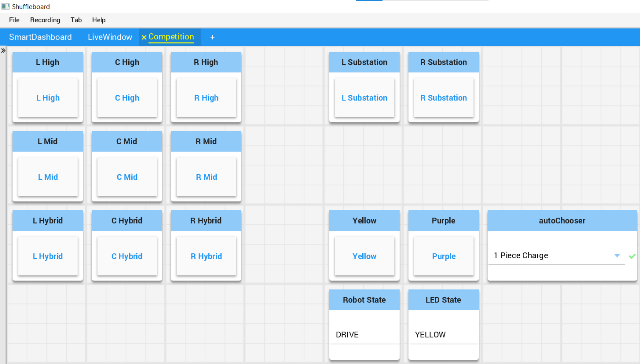

# 2023-robot
The WarriorBots, FRC team 6421, are excited to present our JAVA code for Chameleon, our 2023 competition season robot! 

In general, the main branch will have our most functional, up-to-date code, while other branches will contain code that is currently being modified.

## Other helpful links:
Chief Delphi 2023 Open Alliance Build Thread: https://www.chiefdelphi.com/t/6421-warriorbots-2023-build-thread-open-alliance-2023/420130

2023 Open Alliance Discord: https://discord.com/channels/906202343178137711/1057688409503707197

Team Website: https://warriorbots6421.com/

## RobotStates Enum

The `RobotStates` Enum is used to track the `robotState` the robot should be in and is used throughout the code.  The `robotState` determines the position of the robot's elevator, arm, and wrist. The `robotState` is a static variable defined in 'RobotContainer' class.  There are the following `RobotStates`:
- HIGH_LEFT, HIGH_CENTER, HIGH_RIGHT, MID_LEFT, MID_CENTER, MID_RIGHT, HYBRID_LEFT, HYBRID_CENTER, HYBRID_RIGHT, DRIVE, INTAKE, LEFT_SUBSTATION, RIGHT_SUBSTATION
> Some of the `RobotStates` are not used since we did not get vision working well enough to use in competition.  

## Subsystems

### ArmSubsystem

The robot's arm is controlled with a [SPARK MAX Motor Controller](https://www.revrobotics.com/rev-11-2158/) attached to a [NEO brushless motor](https://www.revrobotics.com/rev-21-1650/) and 120:1 [MAXPlanetary](https://www.revrobotics.com/rev-21-2100/) gear box. The arm is driven with chain and sprocket with a ratio of 1:1 between the sprockets.

- This gear box gives the arm three (3) degrees of rotation of every one rotation of the motor. This three degrees is the position conversion factor for the Spark Max so that we can input degrees as the desired position.

- The required degrees for each arm position were determined by manually moving the arm to the position (along with the elevator and wrist) and recording the angle from a smart phone level. 
- Zero degrees was horizontal toward the front of the robot.  

>TODO Add picture of arm.

The arm angle is controlled with a PIDContoller on the SPARK MAX with just a P value (I and D are zero).

***ArmSubsystem Notes***
- A lot of testing was done to determine a dynamic feedforward for the arm, but this was never used in the final code (not sure if this was on purpose or an accident since the methods with the dynamic feedforward are available in the ArmSubsystem class).  A dynamic feedforward takes into account that the maximum force on the arm is when it is in a horizontal position and decreases as the angle changes.  The needed feedforward changes by a factor of cos as the angle changes from horizontal. In the end the system worked well without a dynamic feedforward.

- See [ArmCommand](#armcommand) to see how a [WPILib TrapezoidProfile](#using-wpilib-trapezoidprofile-in-commands-to-control-motion) was used to control the arm that most likely eliminated the need for the dynamic feedforward.

### BlinkinSubsystem

The robot's LEDs were controlled using a [Blinkin LED Driver](https://www.revrobotics.com/rev-11-1105/)

During game play the LEDs were initially used to signal the human player whether they should place a cone (yellow LED) or Cube (purple LED) in the substation for pick up by the robot.

All the methods were public and static so that the LEDs could easily be changed anywhere in the code.

Due to the Blinkin unit resetting during play we stopped using the LEDs.  It appears that the unit would reset due to hard hits and is a known problem.  TODO add link.
> WPILib has an [Addressable LED class](https://docs.wpilib.org/en/stable/docs/software/hardware-apis/misc/addressable-leds.html) that we used in 2022 without a lot of issues.  We will most likely go back to using this class in the future.

### DriveSubsystem

The team utilized a swerve drive for the first time in competition.  The swerve drive consisted of four [MK4i L2 swerve modules](https://www.swervedrivespecialties.com/products/mk4i-swerve-module).  Each module has two [Falcon 500 motors](https://store.ctr-electronics.com/falcon-500-powered-by-talon-fx/) and a [CANCoder](https://store.ctr-electronics.com/cancoder/) for the absolute encoder. All the swerve modules are on a separate CAN Bus using [Canivore](https://store.ctr-electronics.com/canivore/). The only other device on the Canivore CAN Bus is the gyro used in the [GyroSubsystem](#gyrosubsystem).

The programming team decided that they needed to understand the code for testing and debugging purposes.  So instead of just copying and using another team's swerve code library they wrote their own code based on the code from [Team 364](https://github.com/Team364/BaseFalconSwerve). Although there were struggles to get the code to work properly the programming now has a good understanding of swerve drive code and it has worked well throughout the season.

Some of the struggles were:
- Wheels not aligning properly.  For a long time we thought it was a programming issue, but had nothing to do with our code.  The solution was to add a 1 second delay in the constructor. See this [GitHub issue](https://github.com/Team364/BaseFalconSwerve/issues/8).
- Improper inverts and order of calling the `.configFactoryDefault` method for the motors.  Don't put this method near the end of your constructor.
- Drift caused by improperly tightening the tread on the swerve wheels.  When the mechanical team assembled the swerve modules some screws holding the tread on were not screwed on all the way.  This caused some of the screws to ride on the carpet and affect the contact of the drive wheels to the carpet.  We thought that this was a programming issue and spent a lot of time trying to correct.  Someone noticed a "thumping" sound while driving which lead us to look at the assembly of the modules and lead to the discovery.  The drift was minimal after the screws were tightened properly.
- Optimizing the target angle and placing the absolute angle in the correct scope from 0 to 360 degrees.  In the end we just copied the code for those two methods from Team 364's swerve code.
- When creating the `SwerveModule` class it was created by extending the `SubsystemBase` class instead of being an Empty class. This caused loop overrun errors.  We assumed it has to do with each of the four modules having `periodic` methods running each robot loop.  

The `autoDrive` method was used to drive the robot during the automonous period.  

Our `drive` method is used during the teleop period.  

One unique feature of this method is that there is a `SendableChooser` that allows the controls to be changed depending on the driver.  There are three options:
- Joystick: Using a joystick to control both the x-y direction of the robot and magnitude of the speed.
- Right Trigger: Using a joystick to control the x-y direction of the robot and the right trigger to control the magnitude of the speed. 
- Left Trigger: Using a joystick to control the x-y direction of the robot and the left trigger to control the magnitude of the speed. 

Another unique, and undesirable feature, of the `drive` method is that a deadband is applied twice.  Once when the inputs are first passed to the method and second time after `SlewRateLimiter` filters are applied to the inputs.  This leads to a larger deadband than expected and made control of the robot at lower speeds harder.  This has not yet been corrected.

The SysID Tool was used to characterize the robot drive train.  The measured values were used in the `SimpleMotorFeedforward` on each module and in the autonomous commands.

> A 3D printed wheel alignment jig was made to help hold the wheels in proper alignment when using the SysID Tool. It is screwed onto each of the swerve modules to prevent movement.  Here is the [STEP](SwerveAilgnment.stp) file the alignment jig.
>
> 

### ElevatorSubsystem

The robot's elevator is controlled with a [SPARK MAX Motor Controller](https://www.revrobotics.com/rev-11-2158/) attached to a [NEO brushless motor](https://www.revrobotics.com/rev-21-1650/) and 15:1 [MAXPlanetary](https://www.revrobotics.com/rev-21-2100/) gear box.  Elevator is driven with chain and 1.7567 inch pitch diameter sprockets (ratio of 1:1 between the sprockets). The pitch diameter is important since we are moving the elevator linearly.
- This gear box and pitch diameter of the sprocket gives the elevator 0.002975 meters of motion for every one rotation of the motor. This number is the position conversion factor for the Spark Max so that we can input meters as the desired position.  
- The required meters for each elevator position were determined by manually moving the elevator to the position (along with the arm and wrist) and recording the distance from the elevator in the down or zero position. 
- Zero meters is the elevator all the way down.  

> TODO Add picture of elevator.

The elevator position is controlled with a PIDContoller on the SPARK MAX with just a P value (I and D are zero) and a feedforward (as a percent output). The feedforward is the amount of output to just get the elevator to barely move.

### GyroSubsystem

The gyroscope used on the robot is a [Pigeon 2](https://store.ctr-electronics.com/pigeon-2/).  It is on a separate CAN Bus using [Canivore](https://store.ctr-electronics.com/canivore/) along with the 4 swerve modules.

Although most robot code has the gyro as an object in the drive subsystem our team puts it in its own subsystem since the gyro is not really a "part" of the drive, but is used by the drive and might be used by other subsystems.

All the methods are public and static so they can be accessed with just the class name.

### IntakeSubsystem

The robot's intake is controlled with a [SPARK MAX Motor Controller](https://www.revrobotics.com/rev-11-2158/) attached to a [NEO brushless motor](https://www.revrobotics.com/rev-21-1650/). The intake is driven with belts and pulleys.  The pulley ratio is not important because the motor is driven by percent output.

This is a simple subsystem that just runs the motor at the assigned percent output or stops the motor.

### LimelightSubsystem

Never tuned well enough to reliably use in competition. The code is still available for your review.

### ShuffleboardButtonManager

The `ShuffleboardButtonManager` class creates a competition shuffleboard tab and button objects used to set the robot's [`robotState`](#robotstates-enum). There are buttons for each grid position and left and right for the double substation.  NOTE: Left and right positions are all the same. These were meant to be used with AprilTags and vision, but the team was never able to get vision to work well enough to use in competition.  A picture of the competition shuffleboard tab is below.

Each `robotState` button is an object of the `ShuffleboardButtons` class.  This class set the objects name, Boolean state (true/false), `robotState`, and position within the shuffleboard tab.

The `periodic` method of the `ShuffleboardButtonManager` class is used to detect a button press and changes the `robotState` to the pressed button object's `robotState`.

There are also buttons to control the LED colors for cube or cone pick up.  We stopped using these buttons due to issues with the LEDs.  Please see the [BlinkinSubsystem](#blinkinsubsystem) for information on issues we had with the LEDs.

***ShufflebaordButtonManager Notes***
- The `ShuffleboardButtonManager' class was created after our first competition to remove the controller from the co-pilot's hands.  The co-pilot had a tendency to fidget and press a controller button during a match.
- If the Shuffleboard lost connection with the Network tables during a match we were unable to move the arm, elevator, or wrist.  This didn't happen during a regular season competition, but has happened in an off-season competition.  A backup should be implemented.

### WristSubsystem

The robot's wrist is controlled with a [SPARK MAX Motor Controller](https://www.revrobotics.com/rev-11-2158/) attached to a [NEO brushless motor](https://www.revrobotics.com/rev-21-1650/) and UPDATE [MAXPlanetary](https://www.revrobotics.com/rev-21-2100/) gear box.  Wrist is driven with chain and sprockets (ratio of UPDATE between the sprockets).  The [intake](#intakesubsystem) is attached to the wrist. 
- The gear box and sprocket ratios gives the wrist 2.7 degrees of rotation of every one rotation of the motor. This 2.7 degrees is the position conversion factor for the Spark Max so that we can input degrees as the desired position.  
- The required degrees for each wrist position were determined by manually moving the wrist to the position (along with the arm and elevator) and determining an angle by trial and error.  Trial and error needed to be used due to the zero position angle changing as the arm moved. (No one took the time to calculate, but might have been fairly easy to do.)
- Zero degrees is the wrist all the way touching the arm.    

>TODO Add picture of wrist.

The wrist position is controlled with a PIDContoller on the SPARK MAX with just a P value (I and D are zero).

***WristSubsystem Notes***
- A lot of testing was done to determine a dynamic feedforward for the wrist, but this was never used in the final code due to how the angle that was horizontial changed as the arm angle changed. In the end the system worked well without a dynamic feedforward.

- See [WristCommand](#wristcommand) to see how a [WPILib TrapezoidProfile](#using-wpilib-trapezoidprofile-in-commands-to-control-motion) was used to control the wrist that most likely eliminated the need for the dynamic feedforward.

## Commands

### Autonomous Commands

The programming team made ~10 autonomous commands that could be picked using a `SendableChooser`.  All autonomous commands required the [DriveSubsystem](#drivesubsystem), [ElevatorSubsystem](#elevatorsubsystem), [ArmSubsystem](#armsubsystem), [IntakeSubsystem](#intakesubsystem), and the [WristSubsystem](#wristsubsystem) and their respective subsystem commands to run the autonomous routines.

Each command extended a `SequentialCommandGroup` class and the used the following WPI classes:
- [`Trajectory`](https://docs.wpilib.org/en/stable/docs/software/advanced-controls/trajectories/index.html) class for generating the trajectories needed.
- [`HolonomicDriveController`](https://docs.wpilib.org/en/stable/docs/software/advanced-controls/trajectories/holonomic.html) to help follow the trajectories.
- [`SwerveControllerCommand`](https://github.com/wpilibsuite/allwpilib/tree/main/wpilibjExamples/src/main/java/edu/wpi/first/wpilibj/examples/swervecontrollercommand) to follow the trajectories using the `HolonomicDriveController`.

The `addCommands` method is then used to make a series of robot commands to follow the trajectories, change the ['robotState'](#robotstates-enum), run subsystem commands, and balance the robot on the charge station.  

### Using [WPILib TrapezoidProfile](https://docs.wpilib.org/en/stable/docs/software/advanced-controls/controllers/trapezoidal-profiles.html) in Commands to Control Motion

Our [ArmCommand](#armcommand), [ElevatorCommand](#elevatorcommand), and [WristCommand](#wristcommand) all use a WPILib trapezoid profile to move each of the respective mechanisms from their current state (position) to our desired state (goal position).  This is also used in the [BalanceCommand](#balancecommand).  Using a trapezoid profile improves the motion of a mechanism by setting maximum velocity and acceleration constraints, and then setting setpoints to control the motion between the current position and the goal position.  The motion to the intermediate setpoints still uses a PID controller defined in the subsystem.  Traditionally, one would just use a PID controller to go immediately from the current position to the goal position.  This motion is hard on the mechanism and robot as the motion has no limits and will get to the goal position as fast as possible and can lead to instabilities (e.g. The robot arm moves so fast that it can cause the robot to tip over).    
 
### ArmCommand

The ArmCommand uses the PID controller defined in the [ArmSubsystem](#armsubsystem) to command the arm to a goal position using a [trapezoid profile](#using-wpilib-trapezoidprofile-in-commands-to-control-motion).  The goal position is defined by using the current [`robotState`](#robotstates-enum).
> The velocity and acceleration constraints were determined using trial and error.  There are most likely better ways to do this but it worked of our team.

### BalanceCommand

The BalanceCommand is used to automatically balance the robot on the charge station during the autonomous period. 

The command uses a [WPILib ProfiledPIDController](https://docs.wpilib.org/en/stable/docs/software/advanced-controls/controllers/profiled-pidcontroller.html) to balance the robot. 

The ProfiledPIDcontoller uses a [TrapezoidProfile](#using-wpilib-trapezoidprofile-in-commands-to-control-motion) that sets the maximum velocity and acceleration of the robot when balancing. Using this controller appears to have made balancing easier as we saw lots of other robots using PID loops but these robots appeared to move a lot faster to their setpoint and overshoot (oscillate) a lot more. Every time that we got on the charge station our robot never failed to balance in a competition and there was little or no overshoot. We feel this had to do with the lower maximum velocity and acceleration when the P error was large.   

### ElevatorCommand

The ElevatorCommand uses the PID controller defined in the [ElevatorSubsystem](#elevatorsubsystem) to command the elevator to a goal position using a [trapezoid profile](#using-wpilib-trapezoidprofile-in-commands-to-control-motion).  The goal position is defined by using the current [`robotState`](#robotstates-enum).
> The velocity and acceleration constraints were determined using trial and error.  There are most likely better ways to do this but it worked of our team.

### WristCommand

The WristCommand uses the PID controller defined in the [WristSubsystem](#wristsubsystem) to command the wrist to a goal position using a [trapezoid profile](#using-wpilib-trapezoidprofile-in-commands-to-control-motion).  The goal position is defined by using the current [`robotState`](#robotstates-enum).
> The velocity and acceleration constraints were determined using trial and error.  There are most likely better ways to do this but it worked of our team.
